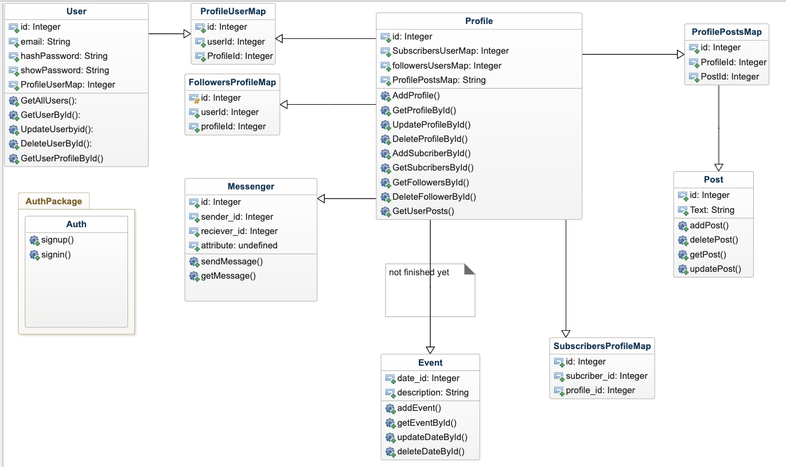

# NGE - New Gen Entrepreneurs

## Introduction

NGE is a platform designed for budding entrepreneurs to connect, share ideas, and grow their businesses.



## API Endpoints

### Health Check

- `GET /health` - Checks the health of the API.

### Users

- `POST /user` - Creates a new user.
- `GET /user/{id}` - Retrieves a user by ID.
- `PUT /user/{id}` - Updates a user by ID.
- `DELETE /user/{id}` - Deletes a user by ID.

### Posts

- `POST /addPost` - Adds a new post.
- `GET /getPost/{id}` - Retrieves a post by ID.
- `PUT /updatePost/{id}` - Updates a post by ID.
- `DELETE /deletePost/{id}` - Deletes a post by ID.

### Events

- `POST /events` - Creates a new event.
- `GET /events/{id}` - Retrieves an event by ID.
- `DELETE /events/{id}` - Deletes an event by ID.
- `PUT /events/{id}` - Updates an event by ID.

## Database Structure

```dbml
Table users {
id bigserial [primary key]
username text [unique]
email text [unique]
password_hash text
}

Table posts {
id bigserial [primary key]
text text [unique]
created_at timestamp
updated_at timestamp
}

Table events {
id bigserial [primary key]
date timestamp
description text
}

Table profiles {
  id Integer [pk, increment]
  <!--  -->
}

Table profile_user_map {
  id Integer [pk, increment]
  userId Integer [ref: > users.id]
  profileId Integer [ref: > profiles.id]
}

Table followers_users_map {
  id Integer [pk, increment] 
  userId Integer [ref: > users.id]
  followerId Integer [ref: > users.id]
}

Table subscribers_users_map {
  id Integer [pk, increment]
}

Table calendar {
  date_id Integer [pk, increment] 
}

Table messenger {
  id Integer [pk, increment]
  sender_id Integer [ref: > users.id]
  receiver_id Integer [ref: > users.id] 
}
Ref: profile > subscribers_users_map.id, followers_users_map, subscribers_users_map
Ref: profile_user_map.userId > users.id
Ref: profile_user_map.profileId > profiles.id
Ref: followers_users_map.userId > users.id
Ref: followers_users_map.followerId > users.id
Ref: messenger > users.id

## Team

22B031105 Zhumabay Dauren.
22B030377 Kenesbek Baisal.
22B030314 Ахметжан Газиза.